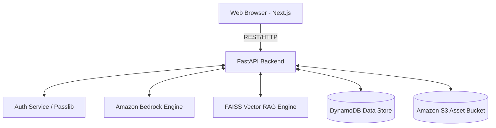

# System Architecture & Design Document

## 1. High-Level Architecture
Thenali AI (Bharat AI Operational Hub) follows a decoupled **Client-Server Architecture**.
- **Frontend Panel**: Built with Next.js 14, acting as the primary presentation tier. State tracking, dynamic rendering, and caching occur locally before synchronizing back.
- **Backend Service**: Built with FastAPI, executing heavy AI operations, vector mappings, and persisting state across robust data clusters.

## 2. Component Design
### 2.1 The RAG Module (`services/rag/pipeline.py`)
Responsible for cloning Git repositories, traversing files, ignoring unwanted directories (e.g., node_modules), extracting raw string content, creating overlapping semantic text chunks, and embedding them via `SentenceTransformers` into a localized FAISS store (`.index` files saved relative to project configurations). It uses `threading.Lock()` to secure its embed-writes, avoiding multi-worker `segmentation_faults`.

### 2.2 LLM Service (`services/aws/bedrock_runtime.py`)
Implements strict connection pooling using `ThreadPoolExecutor(max_workers=5)` shielding the application event-loop from stalling. Native retries operate recursively parsing exponential backoff for `ThrottlingException` (handled by `tenacity`). Responses are uniformly sanitized by a cleaning parser stripping stray artifacts (code fences, json wraps).

### 2.3 Interactive Playground (`services/playground/python_runner.py`)
Utilizes `RestrictedPython` forming an isolated AST context tree mapping valid variables, loops, print routines, and functions. Disables native filesystem overrides, HTTP requests, or terminal breakout hooks natively available to native Python scripts.

## 3. Database Schema (NoSQL Strategy)
Operating on **Amazon DynamoDB**.

- **Table: `bharat_ai_users`**
   - Key: `user_id` (String) - Partition Key
   - Attributes: `email`, `password_hash`, `name`, `full_name`, `api_keys`, `concept_mastery`, `total_repos`, `total_roadmaps`, `avg_assessment_score`, `contribution_cache`.

- **Table: `bharat_ai_repos`**
   - Key: `repo_id` (String) - Partition Key
   - Attributes: `user_id`, `repo_url`, `analysis_status`, `tech_stack`, `architecture`, `created_at`, `files_count`.

- **Table: `bharat_ai_history`**
   - Key: `session_id` (String) - Partition Key
   - Attributes: `user_id`, `topic` optionally bound to `repo_id`, `history` (list of `{"role", "content"}`).

- **Table: `bharat_ai_activity_logs`**
   - Key: `timestamp` / `id` (Partition Key)
   - Attributes: Contextual actions acting as a unified Notification/Logging ledger.

## 4. UI/UX Design System
- **Color Palettes**: Uses intense dark modes (`#09090b` main backgrounds, soft white textual data).
- **Core Accents**: Saffron (`#FF9933`), Bharat Green (`#138808`), and neon blue/purple gradients referencing "Matrix-AI-Cyberpunk" integrations.
- **Component Style**: Heavy Glassmorphism. Transparency overlaid atop soft glowing gradient blobs. Modern typography mapping Google Web Fonts (`Inter`, `Outfit`, `JetBrains Mono` for code blocks).

## 5. Security & Isolation
- User endpoints enforce JWT Bearer authentication parsing the `sub` token back to native user IDs.
- Password hashes generated through robust salt derivations (bcrypt).
- Backend workers restricted by custom Timeout HTTP Middlewares failing safely at `60s` boundaries rather than blocking thread availability indefinitely for standard operations.
